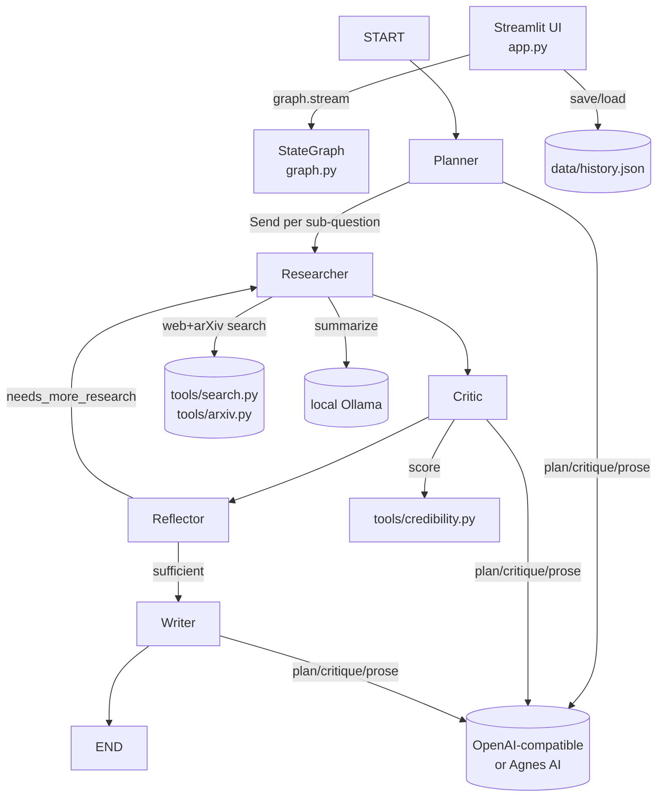
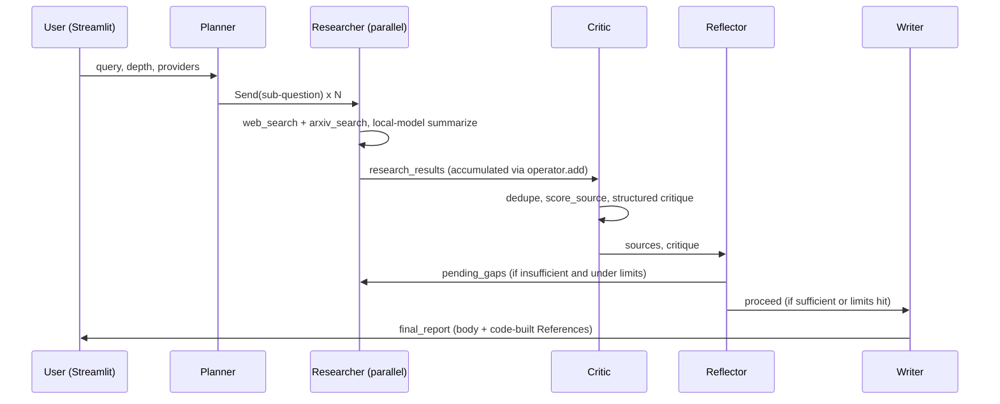

# Architecture

Audited against local checkout `2d0f0677879af28d31640a0c00da6c519e0441de` on
`main` (remote `https://github.com/pypi-ahmad/multi-agent-research-assistant.git`),
2026-08-17. License: MIT (`LICENSE`). Citations point to files in this
checkout.

## What this is

A LangGraph multi-agent system that takes a research query, plans it into
sub-questions, researches each in parallel via web/arXiv search, critiques
and scores the gathered sources, and writes a structured, cited report,
with a Streamlit UI on top (`README.md:3`). It is local-first: it runs
entirely on the user's machine with their own API keys, and persists
research history as a local JSON file.

## Tech stack

| Layer | Technology | Evidence |
|---|---|---|
| UI | Streamlit | `app.py:7,14` |
| Orchestration | LangGraph `StateGraph` with parallel `Send` fan-out | `graph.py:6-7,54-70` |
| Reasoning models | `langchain-openai` `ChatOpenAI`, pointed at either OpenAI's API or Agnes AI's OpenAI-compatible endpoint | `llm.py:5,11-36` |
| Local models | `langchain-ollama` `ChatOllama` | `llm.py:39-51` |
| Web search | `ddgs` (DuckDuckGo, no API key) | `tools/search.py:5` |
| Paper search | `arxiv` | `tools/arxiv.py:5` |
| PDF parsing | `pypdf` | `tools/pdf_loader.py:7` |
| PDF report export | `fpdf2` | `app.py:47` |
| Session store | Plain JSON file (stdlib `json`) | `memory.py` |
| Package management | `uv` | `pyproject.toml`, `launch.cmd` |

## Entry point

`uv run streamlit run app.py` (or `launch.cmd` on Windows, which additionally
installs `uv` if missing, runs `uv sync`, and seeds `.env`). `app.py` is the
only entry point; there is no CLI.

## Commands & Verification Inventory

| Command | Purpose | Evidence |
|---|---|---|
| `uv sync` | Install dependencies from `uv.lock` | `pyproject.toml` |
| `uv run streamlit run app.py` | Run the app (serves on port 8521 per `.streamlit/config.toml`) | `.streamlit/config.toml` |
| `launch.cmd` | Windows one-click setup + launch | `launch.cmd` |
| `uv run ruff check .` | Lint (dev dependency) | `pyproject.toml` (`[dependency-groups] dev`) |

**No automated test suite, no typecheck command, and no CI workflow exist**
in this checkout. This is confirmed by directory listing (no `tests/`, no
`.github/workflows/`) and by `pyproject.toml` containing no `pytest`
dependency. `CONTRIBUTING.md` states this explicitly and asks contributors
to test manually.

## Directory layout

| Path | Purpose |
|---|---|
| `app.py` | Streamlit UI: sidebar (past sessions), query form, live agent-progress stream, tabbed results, follow-up flow |
| `graph.py` | LangGraph wiring: node registration, the `Send`-based dispatch/reflect-loop conditional edges, `initial_state()` |
| `state.py` | `ResearchState` `TypedDict` (with `operator.add` reducers for parallel researcher output) plus `Source`/`Critique` schemas |
| `config.py` | Env var reads, depth presets, timeouts, paths |
| `llm.py` | Model constructors: `get_reasoning_llm` (OpenAI/Agnes) and `get_local` (Ollama) |
| `memory.py` | JSON-backed session history: load/get/save/delete/summarize |
| `agents/planner.py` | Turns the query into N sub-questions (reasoning model) |
| `agents/researcher.py` | Per-sub-question web+arXiv search and local-model summarization; runs as a `Send` target |
| `agents/critic.py` | Deduplicates/scores sources deterministically, then judges sufficiency/conflicts/off-topic sources (reasoning model) |
| `agents/reflector.py` | Deterministic loop/stop decision, no LLM call |
| `agents/writer.py` | Drafts the report body (reasoning model) and appends a code-assembled References section |
| `tools/search.py` | DuckDuckGo web search |
| `tools/arxiv.py` | arXiv paper search |
| `tools/pdf_loader.py` | PDF text extraction for uploaded reference documents |
| `tools/credibility.py` | Deterministic authority/relevance/recency/trust scoring |

## Deployment & runtime surface

Local-only; no container, no CI runner image, no deployed service. Python
`>=3.11` (`pyproject.toml:4`), managed by `uv`. Streamlit is pinned to
port `8521` via `.streamlit/config.toml`. All persistence
(`data/history.json`) lives under `DATA_DIR` (`config.py:47`), created on
first write.

## EOL / dead-dependency scan

Nothing EOL `[INFERRED: no version pins exist in pyproject.toml/uv.lock
that were checked against advisory databases beyond a manual read]`. No
dead-config or unreachable-provider issues found (unlike a sibling project
in this author's other repos): every env var in `config.py` maps to a
UI-selectable option or a real timeout used in `llm.py`.

One dead-code item, now fixed as of this checkout: `memory.summarize_for_followup()`
previously had zero call sites; `app.py`'s follow-up flow duplicated its
exact truncation logic inline instead of calling it. This has been
corrected (`app.py`'s follow-up handler now calls
`memory.summarize_for_followup`), so the function is live again.

## Data, APIs, background jobs, CI/CD, testing

- **Data:** a single local JSON file, `data/history.json`, holding every
  past research session (query, depth, model, plan, sources, report),
  unencrypted, rewritten in full on every save (`memory.py:34-59`).
- **APIs:** none exposed by this app; it is a client of the reasoning
  provider (OpenAI-compatible or Agnes AI), a local Ollama server, and
  DuckDuckGo/arXiv for search.
- **Background jobs:** none. A research run executes synchronously inside
  the Streamlit button-click handler, with the LangGraph stream driving a
  live `st.status` progress display (`app.py:80-86`).
- **CI/CD:** none exists.
- **Testing:** none exists (see Commands inventory above).

## Architectural blueprint

**Layering:** `app.py` (UI) → `graph.py` (orchestration) → `agents/` (domain
logic) → `tools/` + `llm.py` + `config.py` (leaf dependencies). Nothing in
`agents/` or `tools/` imports `app.py` or `graph.py`; that's one-way by
convention, not enforced by tooling.

**Cross-cutting concerns**

| Concern | Location | Evidence |
|---|---|---|
| Config/secrets | `.env` via `python-dotenv`, read once at import time; OS env vars take precedence | `config.py:8-13` |
| Model routing | Two factory functions are the sole choke points: `get_reasoning_llm` (provider-agnostic OpenAI-compatible) and `get_local` (Ollama) | `llm.py:11,39` |
| Timeouts | Every LLM call is time-bounded so a hung endpoint can't freeze a run | `llm.py:23,35,50`, `config.py:33-34` |
| Error handling | Every agent node wraps its LLM call in `try/except Exception` and degrades to a safe default (fallback plan, fail-open critique, error-message report body) rather than crashing the graph | `agents/planner.py:48-59`, `agents/critic.py:74-82`, `agents/writer.py:71-80` |
| Loop termination | Reflector is deliberately not an LLM call, a hard, rule-based gate | `agents/reflector.py:1-7,22` |

**Inferred ADRs**

- **ADR: The Reflector is plain Python, never an LLM call.** *Context:*
  whether a critique/re-research loop terminates cannot be allowed to
  depend on a model choosing to respect a limit. *Decision:*
  `reflector_node` checks `revision_count >= max_revisions` and
  `step_count >= max_steps` in code (`agents/reflector.py:22`).
  *Consequences:* the loop is guaranteed to terminate regardless of model
  behavior, at the cost of a rigid, non-adaptive stopping rule.
- **ADR: Credibility scoring is deterministic, never LLM-judged.**
  *Context:* a trust score that could be hallucinated or manipulated by
  prompt phrasing would undermine the "hallucination-resistant references"
  guarantee. *Decision:* `tools/credibility.py` computes authority (domain
  allow-list + TLD), relevance (token overlap), and recency (date math)
  with no model call, then blends them into `trust_score`
  (`tools/credibility.py:77-86`). *Consequences:* scoring is fast, free,
  and reproducible, but a genuinely reputable source on an unrecognized
  domain gets only `DEFAULT_AUTHORITY = 5.0`, a known simplification.
- **ADR: The References section is assembled from code, not generated
  text.** *Context:* an LLM asked to write "sources" can invent URLs.
  *Decision:* the Writer's system prompt forbids writing a references
  section itself; `_build_references()` appends one built directly from the
  scored, filtered source list (`agents/writer.py:38-47,82`).
  *Consequences:* every citation traces to something actually retrieved,
  at the cost of the reference list's formatting being fixed rather than
  stylistically adaptable by the model.
- **ADR: Researcher runs as a LangGraph `Send` target, not a state-reading
  node.** *Context:* true parallel fan-out per sub-question needs each
  branch to see only its own payload, not the full accumulating state.
  *Decision:* `researcher_node(payload: dict)` takes the small dispatch
  payload (`subquestion`/`local_model`/`sources_per_subquestion`) rather
  than `ResearchState` (`agents/researcher.py:27`), and results merge back
  via `Annotated[list[Source], operator.add]` (`state.py:54-56`).
  *Consequences:* branches can't see each other's partial results or the
  original plan, which is acceptable since each branch's job (search +
  summarize one sub-question) is self-contained.

**Governance:** none. No CODEOWNERS, no branch protection, no CI to
protect against in the first place. `CONTRIBUTING.md` and the PR template
are the only process guardrails, both advisory.

**How to add a feature:** add or modify a node in `agents/`, wire it into
`build_graph()`'s edges in `graph.py`, extend `ResearchState` in `state.py`
if new fields are needed, and update `README.md`'s Features/How-It-Works
sections in the same change (convention only, nothing enforces it).

## Subsystem deep-dives

### 1. The parallel research loop (`graph.py`, `agents/researcher.py`, `state.py`)

The Planner produces a list of sub-questions; `_dispatch_research()` turns
each into a `Send("researcher", payload)` (`graph.py:18-32`), which
LangGraph executes as independent parallel branches. Each branch's
`researcher_node` never sees `ResearchState` (only its own payload), so
there is no shared-state race to reason about. Results from all branches
converge back into `research_results` via the `operator.add` reducer
(`state.py:54`), which is why `ResearchState` declares `research_results`,
`step_count`, and `errors` as `Annotated[..., operator.add]`: they're the
only fields multiple parallel writers touch simultaneously, everything
else is a single-writer overwrite. The same dispatch pattern is reused by
`_reflect_router()` (`graph.py:35-51`) to re-fan-out gap sub-questions when
the Critic finds the research insufficient; the loop's only difference
from the initial dispatch is that it targets `pending_gaps` instead of the
original `plan`.

### 2. Critic scoring, filtering, and the safety-bounded loop (`agents/critic.py`, `agents/reflector.py`, `tools/credibility.py`)

Before any LLM is involved, `_dedupe_and_score()` collapses sources by URL
and computes a deterministic `trust_score` for each (`agents/critic.py:32-39`,
`tools/credibility.py:77-86`: `authority*0.4 + relevance*0.35 + recency*0.25`).
Only then does a structured-output call to the reasoning model judge
sufficiency, conflicts, and (via `irrelevant_indices`) which sources are
off-topic and should be dropped entirely (`agents/critic.py:26-28,84-85`).
The Reflector then makes the loop/stop call purely from state counters
(`revision_count`/`max_revisions`, `step_count`/`max_steps`) and the
critique's `sufficient`/`gaps` fields, never re-invoking a model
(`agents/reflector.py:14-32`). `max_revisions`/`max_steps` themselves come
from `DEPTH_PRESETS` (`config.py:38-42`), so the "Quick/Standard/Deep" UI
choice is what ultimately bounds worst-case cost and latency.

### 3. Follow-up research and session persistence (`memory.py`, `app.py`)

Every completed run is written in full to `data/history.json`
(`memory.py:34-59`): there is no incremental append; the whole file is
read, filtered, and rewritten on every save, which is fine at
personal-history scale but wouldn't scale to a large session count.
Follow-up questions reuse the same graph and the same five-node pipeline;
the only difference is `previous_context` in `initial_state()`, populated
from `memory.summarize_for_followup()`, a straight `report[:max_chars]`
truncation (`memory.py:67-70`), so the Planner's prompt explicitly asks
for sub-questions that extend rather than repeat the prior research
(`agents/planner.py:27-32`).

## Confidence assessment

| Claim area | Confidence |
|---|---|
| LangGraph pipeline structure, parallel dispatch, and loop termination | High: read directly from `graph.py`, `agents/reflector.py`, `state.py` |
| No CI/tests/lint-enforcement exists | High: confirmed by directory listing and `pyproject.toml` contents |
| Credibility scoring formula and off-topic filtering | High: read directly from `tools/credibility.py`, `agents/critic.py` |
| `memory.summarize_for_followup` being wired up | High: confirmed via `grep`; this checkout has the fix applied |
| Session-store write performance at scale | Inferred: no benchmark was run; conclusion follows directly from `memory.py`'s full-file rewrite-on-every-save pattern |

## Footnotes

- `README.md`: features, tech stack, setup, env vars, architecture narrative
- `graph.py`: LangGraph graph construction, dispatch/reflect conditional edges
- `state.py`: `ResearchState` and nested `Source`/`Critique` schemas
- `config.py`: env var reads, depth presets, timeouts, paths
- `llm.py`: reasoning/local model factory functions
- `memory.py`: JSON-backed session history store
- `app.py`: Streamlit UI, run/follow-up orchestration, result rendering
- `agents/planner.py`, `agents/researcher.py`, `agents/critic.py`, `agents/reflector.py`, `agents/writer.py`: the five graph nodes
- `tools/search.py`, `tools/arxiv.py`, `tools/pdf_loader.py`, `tools/credibility.py`: search and scoring tools
